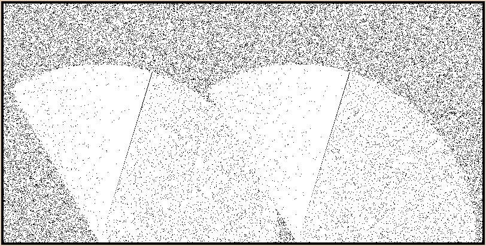

## Miniprojet 3 - Signaux
Le but du miniprojet est de commander un moteur d'essuie-glace en utilisant le mécanisme
des signaux.


### Description
il y a deux programmes :
 - le simulateur "graphique" du pare-brises avec les essuies-glaces et la pluie.
 - un pilote qui permet de commander le moteur du simulateur.

Le [programme](./src) de simulation vous est donné. Votre travail consiste à écrire le pilote.
 
Le moteur possède 4 modes (commandes) : 

 - arrêt,
 - continu lent,
 - continu rapide,
 - impulsion.

Le processus qui  simule  les essuies glaces est contrôlé par les signaux suivants :

```
          lent
SIGHUP ---------------->+-----------+
                        |           |
                        |           |
          rapide        |           |
SIGPIPE --------------->|           |
                        |           |
                        |  MOTEUR   |
          impulsion     |           |
SIGUSR1 --------------->|           |
                        |           |
                        |           |
          arrêt         |           |
SIGUSR2 --------------->+-----------+
```

Vous devez écrire un programme `pilote` qui permet de faire fonctionner les essuies glaces à partir de 4 commandes :
- M (Marche),
- A (Arrêt),
- \+ (pour augmenter la vitesse)
- \- (pour diminuer la vitesse).

Le fonctionnement du pilote est régi par l'automate suivant 

```
       M/A                          +---------+
+---------------------------------->|  Arrêt  |<------------+
|                                   |         |             |
|                                   +----+----+             |
|-----------------------------------+    |                  |
|         +-----------------------+ |    | M/A              |
|         |             -         | |    v                  |  - (N==10)
|      +  |     +------------->+------------------+         |
|         v     |              |   continu lent   |         |
|   +-------------------+      |                  |         |
|---|  continu rapide   |      +------------------+         |
|   |                   |         ^           |             |
|   +-------------------+       + | (N==3)    | -           |
|                                 |           | N<-3        |
|                                 |           v             |
|                           +--------------------------+    |
+---------------------------|    intermittent toutes   |----+
                            |    les N secondes        |
                       +--->+                          |<---+
                       |    +--------------------------+    |
                       |          |             |           |
                N<-N-1 |          |             |           |  N<-N+1
                       |          |             |           |
                       +----------+             +-----------+

                              + (N>3)                  - (N<10)
```

Au lancement du programme, le moteur est à l'arrêt. L'appui sur la touche Marche
le fait passer en mode "Continu lent". 

Les passages du mode "Continu lent" au mode "Continu rapide" et réciproquement se font respectivement par l'appui sur la touche +
et par l'appui sur la touche -.

Du mode "Continu lent", il est possible de passer au mode "Intermittent" par l'appui
sur la touche -. Dans ce mode, le moteur se met en marche toutes les 3 secondes. Il est
possible d'ajuster la vitesse du mode "Intermittent" à l'aide des touches + pour
augmenter la vitesse d'une seconde, et – pour ralentir la vitesse d'une seconde.

En deçà de 3s, le moteur se remet en mode continu lent et au delà de 10 secondes,  il s'arrête.


Le pilote sera contrôlé depuis le clavier via les signaux envoyés par le terminal (line discipline) :

| Signal   |  Libellé         | Simule   |Généré par    |
|----------|------------|:---------:|---------|
| SIGINT   |  interrupt   |  **M/A**        |Ctrl-C     |
| SIGQUIT  |    quit      |  **+**         |Ctrl-X           |
| SIGTSTP  | stop         |  **-**          |Ctrl-Z   |
|SIGALRM   | alarm        | **intermittent** |alarm(N) |


### Votre travail (vendredi 17 décembre)
Écrire un programme `pilote.c` qui lance le simulateur, et qui permet de contrôler 
les essuies glaces à partir du clavier. (à rendre [ici](http://www.iut-fbleau.fr/site/site/DEVOIR))

```
                     SIGALRM
                        |
                        |
                        |
                        v
      CTRL-Z       +----------+  continu lent
 -   ------------->|          |--------------------+
      SIGTSTP      |          | SIGHUP             |
                   |    P     | continu rapide     |
                   |    I     |-------------+      v
      CTRL-X       |    L     | SIGPIPE     +---->+------------+
 +   ------------->|    O     |                   |   MOTEUR   |
      SIGQUIT      |    T     | impulsion   +---->+------------+
                   |    E     |-------------+      ^
                   |          | SIGUSR1            |
      CTRL-C       |          | On/Off             |
M/A  ------------->|          |--------------------+
      SIGINT       +----------+ SIGUSR2
```
